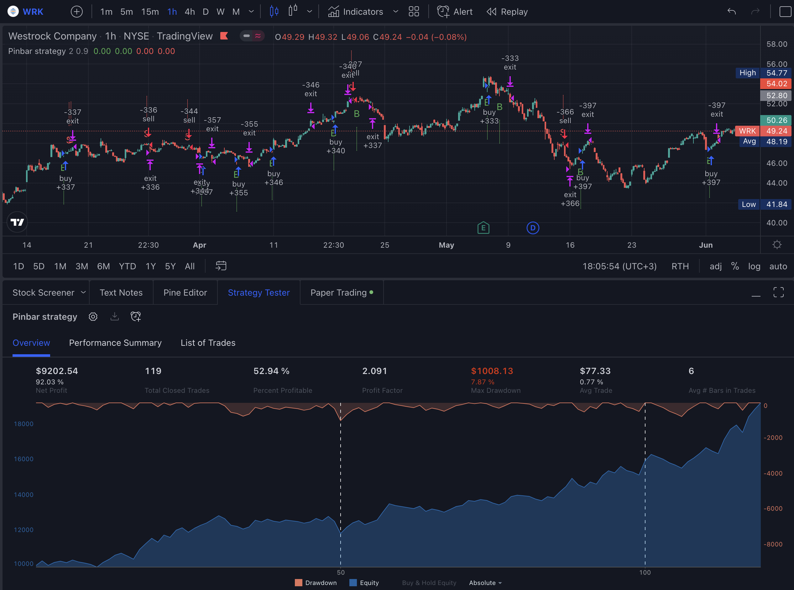
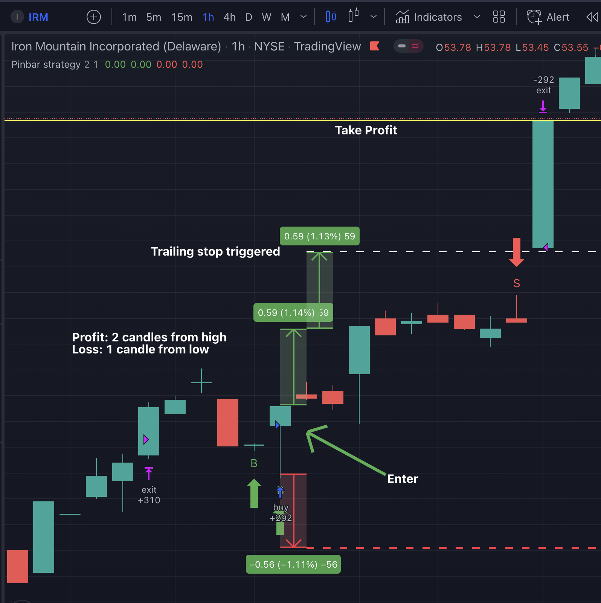
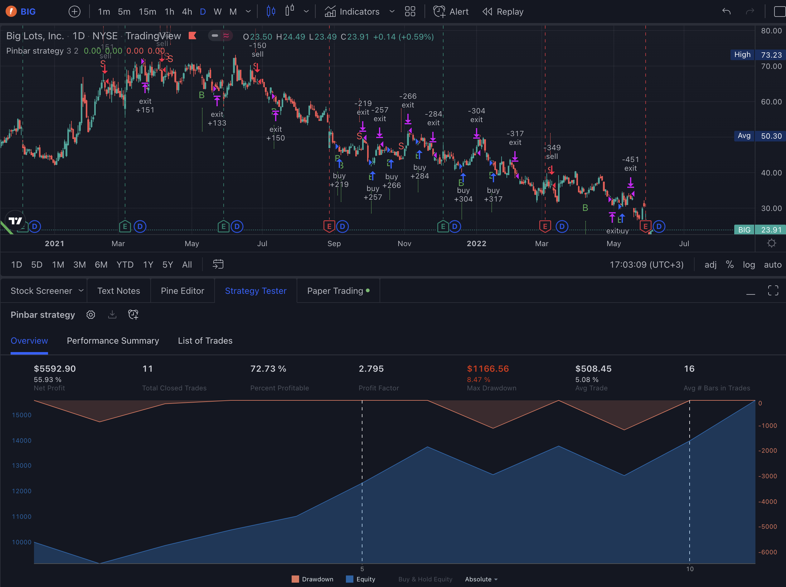
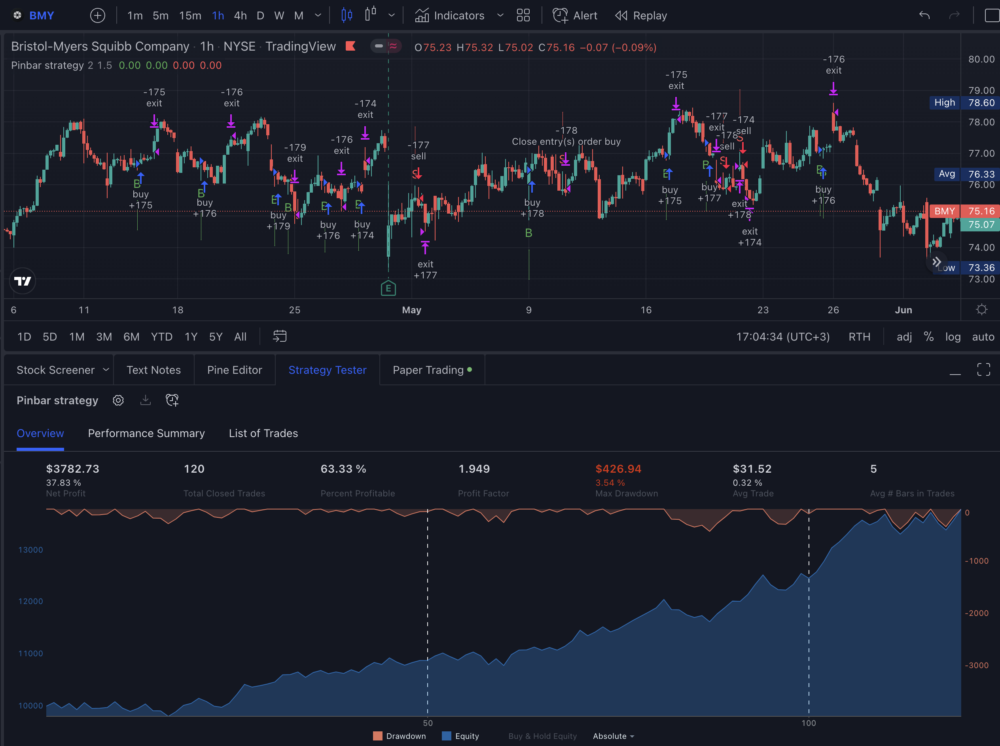
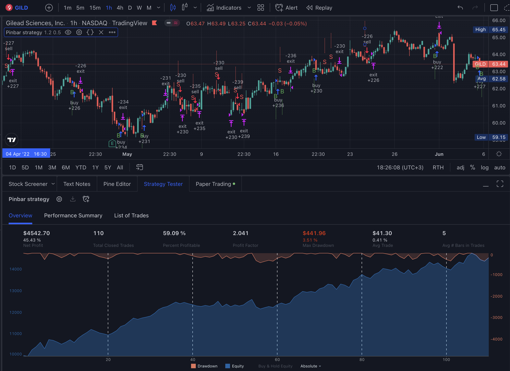
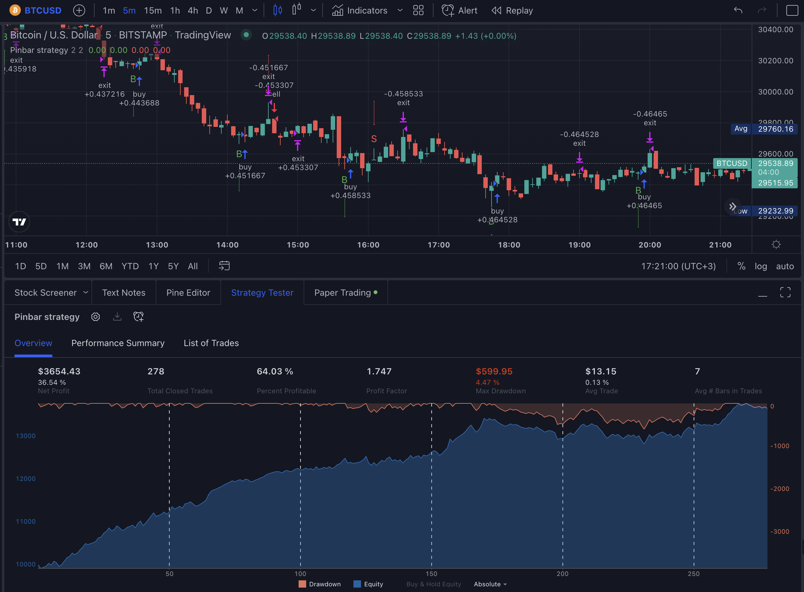

# pinbar-strategy-tradingview

(Pinescript) Pinbar trading strategy for TradingView

[Link to TradingView script](https://www.tradingview.com/script/QtCWpUWb-Pinbar-trailing-stop-strategy/)

## Explanation

The strategy finds the nearest pinbar pattern and opens a position (long or short). You choose your take profit and stop loss multiplier.

* Take Profit - X times the pinbar size from it's highest point.
* Stop loss - X times the pinbar size from it's lowest point.

You need to determine the best TP/SL combination on your own for each chart. Start from 1:1 or 2:1. Keep in mind your brocker fee.

### More examples

BIG 1D

BMY 1H

GILD 1H

BTC/USD 5M

